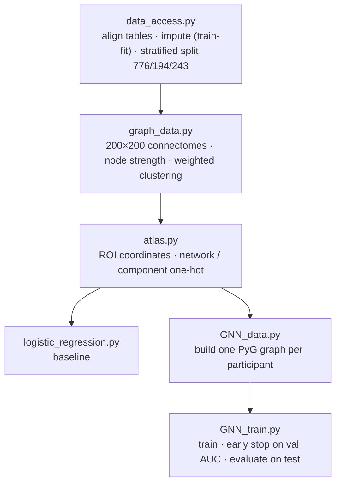
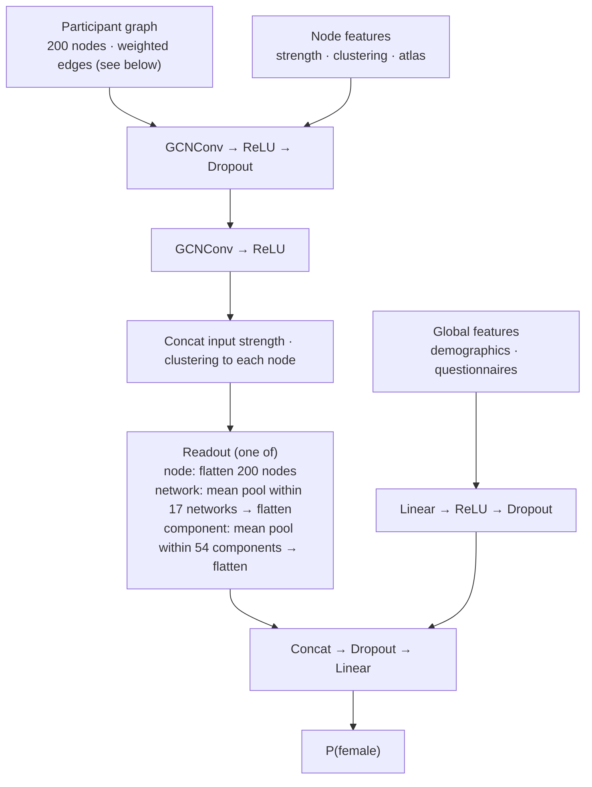

# Brain-Connectome GNN for Sex Classification

Predicts participant sex (`Sex_F`) from resting-state fMRI connectomes and
demographic/questionnaire data (WiDS Datathon 2025), using a GNN on the
Schaefer-200 parcellation.

## Data

Not included. Expected layout, one level above this repo:

```
widsdatathon2025_new/
├── Schaefer200_merged_labels.csv
└── TRAIN_NEW/
    ├── TRAIN_FUNCTIONAL_CONNECTOME_MATRICES_new_36P_Pearson.csv
    ├── TRAIN_CATEGORICAL_METADATA_new.xlsx
    ├── TRAIN_QUANTITATIVE_METADATA_new.xlsx
    └── TRAINING_SOLUTIONS.xlsx
```

## Pipeline



```bash
pip install -r requirements.txt
python data_access.py
python graph_data.py
python atlas.py
python logistic_regression.py
python GNN_train.py
```

Outputs go to `dataStorage/`; each GNN run saves its metrics, history and curves to `dataStorage/GNN_Run/<run>/`.

## Model



**Graph construction** (one graph per participant):

- **Nodes:** the 200 Schaefer ROIs.
- **Edge weight:** |r<sub>ij</sub>|, the absolute value of the precomputed Pearson correlation between ROIs *i* and *j*, taken from the provided connectome file (`..._36P_Pearson.csv`).
- **Sparsification:** keep an edge only if |r<sub>ij</sub>| is in that participant's top 20% of the 19,900 ROI pairs. The graph is undirected, with no self-loops.
- **Node features:** strength (Σ<sub>j</sub>|r<sub>ij</sub>|) and weighted clustering coefficient, both computed on the dense |r| matrix, then z-scored per ROI using the mean and SD across training participants; plus fixed atlas features (RAS coordinates, one-hot network and component).

Loss: BCEWithLogits. Optimiser: AdamW, with a separate weight decay on the global branch.
The decision threshold is chosen on validation and applied unchanged to test.

## Results

Single split (train/val/test = 776/194/243), single training seed.
Hyperparameters were selected on the validation set only (for the GNN, separately for each readout); the test set was evaluated once per selected configuration.

| Model | Val AUC | Test AUC | Test Acc |
|---|---|---|---|
| Logistic regression (C = 0.01) | 0.645 | 0.744 | 0.749 |
| GNN, node readout | 0.665 | 0.757 | 0.724 |
| GNN, network readout | 0.675 | 0.719 | 0.560 |
| GNN, component readout | 0.665 | 0.726 | 0.543 |

Test AUC exceeds validation AUC for every model, including the linear baseline,
which points to split variance rather than overfitting to the test set
(with ~200 samples, the standard error of AUC is ≈ 0.04).
Differences between models are within this range. Cross-validated mean ± std is in progress.

## Tests

```bash
python test_graph_data.py
python test_gnn_data.py
python test_logistic_results.py gender
```

## Environment

Python 3.13 · PyTorch 2.10 · PyG 2.8 · scikit-learn 1.5 · NetworkX 3.6 · pandas 3.0
